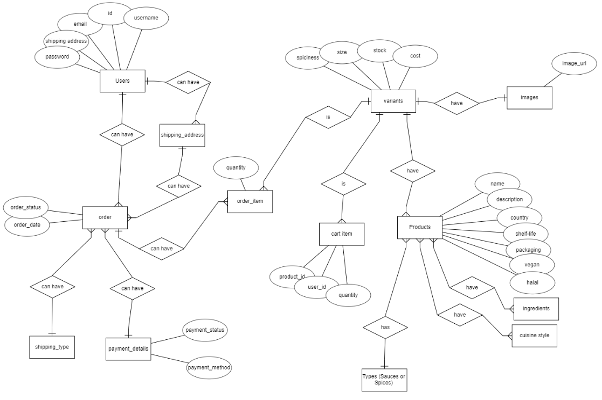
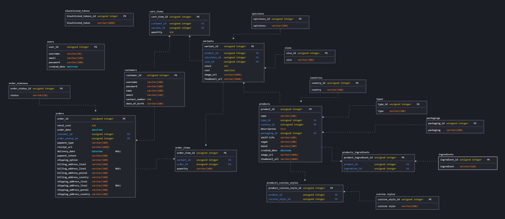

# tgc-18-project-3-backend-SolelySpice

### Frontend Web Interface
- Refer to github frontend react webpage over [here](https://github.com/xunne899/tgc18-project3-frontend) for more details.

### BackEnd Database
- Refer [here](https://github.com/xunne899/tgc18-backend-project3) for more gitub backend database details

### Live Demo
  Link of live backend demo can be found [here](https://project3-spice-sauce.herokuapp.com/login)

# Summary

- API endpoint CRUD was created
- Deployed to Heroku

Test Accounts for backend admin

| Email              | Password |
| ------------------ | -------- |
| test@gmail.com     | 123      |


### Database Name

- spice_sauce


### ERD



### Schema




## Sample of Database Route
### Get/Request

```
GET /products
```

### Results/Response

```
Results of all products will show
```

### Create a new product

```
POST /products/create
```

### Results/Response

```
New product will be added to  database
```

### Edit a product

```
POST products/:product_id/update
```

### Results/Response

```
Product with id is updated in database
```

### Delete a product

```
DELETE products/:product_id/delete
```

### Results/Response

```
product with id is deleted from database
```


## Testing

- POST, GET, PUT, DELETE testing was done through Advanced REST Client (ARC)<br>
  Link of ARC software can be found [here](https://install.advancedrestclient.com/install)

## Live Deployment

- Deployment is through Netlify for react frontend<br>
  Link of live Netlify deployment can be found [here](https://solely-spice.netlify.app/)

- Deployment is through heroku for backend database<br>
  Link of live HEROKU deployment can be found [here](https://project3-spice-sauce.herokuapp.com/login)

## Main Tehnology Used (BackEnd Database)

- db-migrate - migrate backend files
- Bookshelf- backend database
- hbs - for backend file display
- SQL- backend database
- Express Node JS- Backend programming
- knex
- CORS
- doteenv file